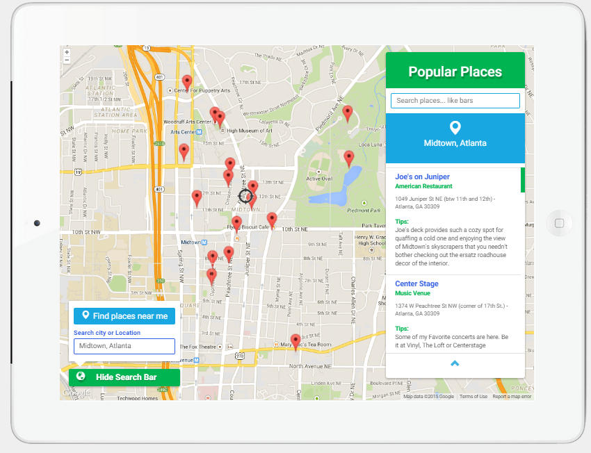
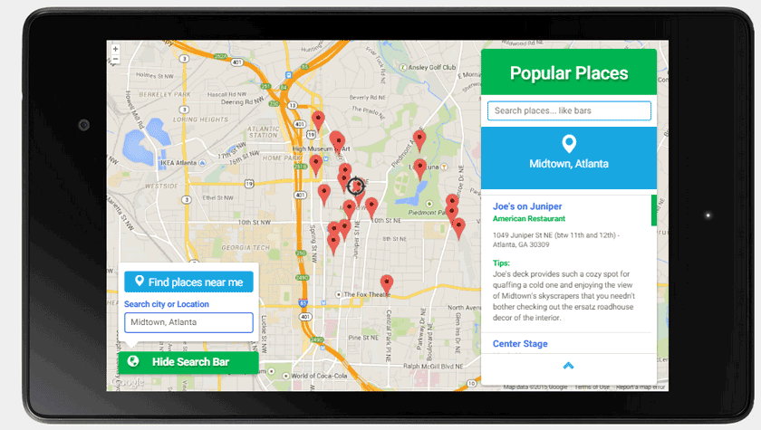
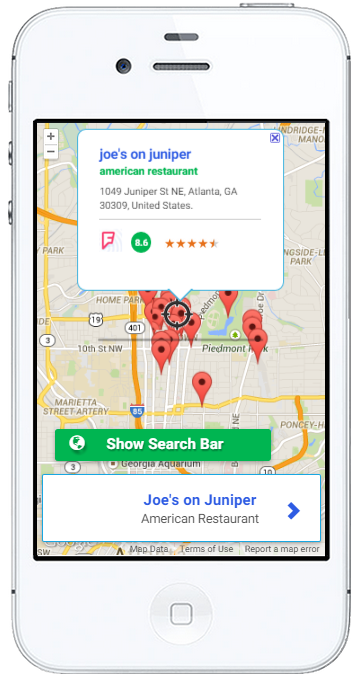
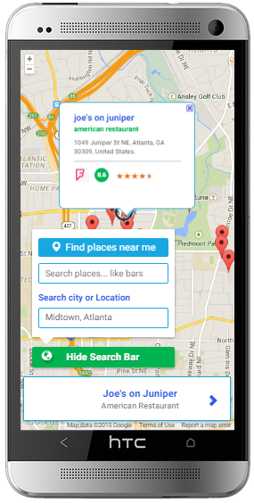

## Neighborhood Map Project

### Summary

This is a <b>Google Maps-based Web Application</b> where users can find Foursquare's top popular places near
their geolocation or a location they choose.

The main purpose of this app is to give users an easy-to-use platform, with a simple, clean UI
that allows them to search interesting places to visit.

### Application Structure, Components and Tools

* The application structure is based on Model-View-ViewModel pattern, implemented through the use of
  <b><a href="http://knockoutjs.com/documentation/introduction.html">KnockoutJS JavaScript framework</a></b>.
  KO library makes it very easy for developers to bind data with templating features to create dynamic
  views. This app takes advantage of this KO feature by generating sections that are update automatically whenever
  the user enters a place of location on the input fields.

* The data displayed on the view is requested from <b><a href="https://developer.foursquare.com/overview/">Foursquare
  API</a></b> leveraging JQuery's <b>Ajax method.</b>

* The map was created with <b><a href="https://developers.google.com/maps/documentation/javascript/tutorial">Google Maps
  JavaScript API</a></b>, and the locations requested for users are processed with
  <b><a href="https://developers.google.com/maps/documentation/geocoding/">Google Geocode Service API</a></b>.
  To provide users with popular places near their geolocation, we used <b>HTML5 geolocation API</b>.

Other tools used to create this app:

* <b><a href="http://bower.io/">Bower</a></b>, for easy installation and management of Knockoutjs and jquery libraries.
* <b><a href="http://gulpjs.com/">GulpJS</a></b>, for code optimization and compression to build a production-ready
  version of the app.

The files are organized in the following way:

* build folder - contains compressed js and css files.
* images folder - containing the images.
* index.html - compressed version of development-version/index.html. Includes paths to complied files on build dir.
* development-version - The develoment version of the app.
* development version-with-requirejs - A dev version of the app created using RequireJS, an AMD module loader.

### How to use
If you are familiar with Google Maps, you will find this application fairly simple to use.

Besides the search areas, where users can look for a specific location or place, this program is
operated primarily through interacting with the map markers. There are two ways to do this:

1- Click on a marker to get the information about a location. 
2- Click on one of the places displayed on the list (upper right side, for big screens; bottom left corner,
   for tablets and smart phones).

A live version of this website is available
at <a href="http://yozaira.github.io/frontend-nanodegree-project5-knockout-gmaps">Neighborhood Map Project</a>.
This is the production version; however, its functionality should be synchronized with the development version
at all times.

### Optional future improvements:
Fine tune the city search.  When user looks for a city, in addition to the requested city, the Geocoder Service will
will output other places in different countries with the same name or, in some cases, when the name is included on the address.  As a result, Google Maps Bounds will adjust the map level zoom to keep all the places visible on the map. For example, a search for 'buenos aires' will output the capital city of Argentina in addition to a location in Mexico.
My guess is that this behavior is related to the use of Foursquare API as location data. For future tests, I will use Google Places API and other API data instead, to see if the behavior is different.

### Final Result:

